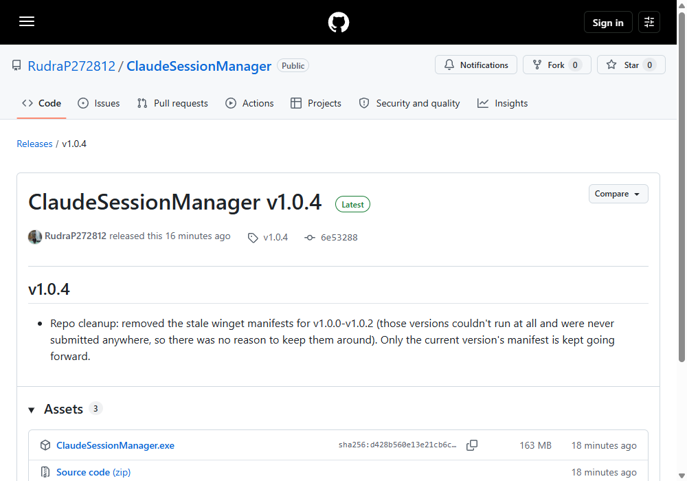

<p align="center">
  
</p>

<p align="center"><b>ClaudeSessionManager</b> — a TraceFix project</p>

<p align="center">
  <a href="LICENSE"></a>
  <a href="https://github.com/RudraP272812/ClaudeSessionManager/releases"></a>
  <a href="https://github.com/RudraP272812/ClaudeSessionManager/stargazers"></a>
  <a href="https://github.com/RudraP272812/ClaudeSessionManager/actions/workflows/build.yml"></a>
</p>

A free Windows desktop app that finds every **Claude Code** CLI session on your machine and lets you search, review, and **delete session history** in bulk — no more hunting through `.jsonl` files by hand.

## Why this exists

Claude Code has no delete button, no cleanup command, nothing in its own interface to remove old session history — every session it ever creates stays on disk forever under `~/.claude/projects`, whether you still need it or not. We ran into this ourselves: sessions piling up with no first-party way to clear any of them out. ClaudeSessionManager exists to close that one gap — a real interface to see everything Claude Code has saved, and delete what you don't need.

## Download

**[⬇ Download for Windows](https://github.com/RudraP272812/ClaudeSessionManager/releases/latest)** — free installer, no account, no telemetry.

Or from a terminal, once the winget listing is live:

```powershell
winget install TraceFix.ClaudeSessionManager
```

## Features

- Scans `~/.claude/projects/*.jsonl` for every Claude Code session stored on disk.
- Cross-references the VS Code "Claude Code" extension's local cache, so titles and archived state match what you already see in VS Code.
- Live search across title, project path, session id, and first-message preview.
- Multi-select and delete sessions — including their attachment sidecar folders — with a confirmation prompt before anything is removed.
- 100% local. No account, no telemetry, no network access of any kind.

## Remove Claude Code session history

If you searched **"claude code session removal"**, **"claude code history remove"**, or **"how to delete archived Claude Code sessions"** — this is that tool. The Claude Code CLI keeps every session transcript on disk indefinitely under `%USERPROFILE%\.claude\projects\`, and there's no built-in command to clean them up. ClaudeSessionManager finds all of them, shows which are archived, and lets you delete the ones you don't want — permanently, immediately, and only ever on your own machine.

### How do I clear Claude Code history on Windows?

Open ClaudeSessionManager, let it finish scanning, search or scroll to find the session(s) you want gone, select them, and click **Delete Selected**. Deleting removes the session's `.jsonl` transcript and its attachment folder (if any); there is no undo, which is why the app always asks first.

## How it works

- Sessions are read directly from `%USERPROFILE%\.claude\projects\<project>\<session-id>.jsonl` — each file is streamed line-by-line to pull a title and a preview of the first message, without loading the whole transcript into memory.
- If the same session was ever opened in VS Code, its `state.vscdb` cache (SQLite, read-only) is checked for a human-assigned label and archived flag, so the two tools agree on what a session is called.
- Deleting a session removes its `.jsonl` file and, if present, the same-named sidecar folder that holds its attachments/tool output.

## Build from source

Requires the .NET 8 SDK.

```powershell
dotnet build ClaudeSessionManager.csproj -c Release
```

## Privacy

ClaudeSessionManager makes no network calls of any kind — no update checks, no analytics, nothing. Everything it reads and deletes stays on your machine.

## Trademark

The source code in this repository is licensed under the MIT License (see [LICENSE](LICENSE)). The **TraceFix**™ name and logo are not covered by that license and may not be used to represent your own builds or forks without permission.

## Contact

rudrapatel201@gmail.com

## License

MIT — see [LICENSE](LICENSE).

## How to download

1. Go to the [latest release](https://github.com/RudraP272812/ClaudeSessionManager/releases/latest).
2. Under **Assets**, click `ClaudeSessionManager.exe`.



3. Because this is a new app with no download history yet, your browser may warn that the file "isn't commonly downloaded." That's just Chrome/Edge's reputation check — it hasn't seen enough downloads of this specific file, not a sign of an actual problem. The source code above is everything the app does; see [Privacy](#privacy) for why it's safe to run.
4. If you see that warning: click the **•••** next to the blocked download in your downloads bar → **Keep** (you may be asked to confirm once more — choose **Keep anyway**).
5. Run `ClaudeSessionManager.exe` — it's a single portable file, no installer, no setup wizard.
